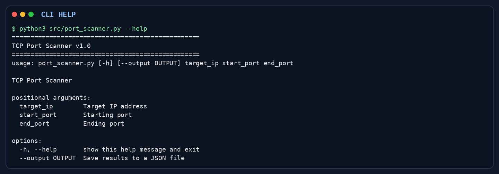
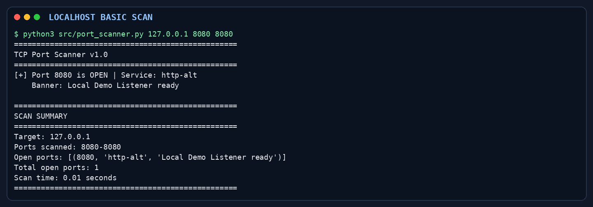
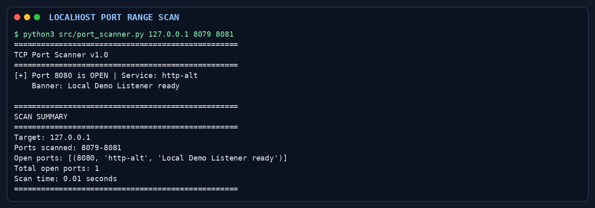
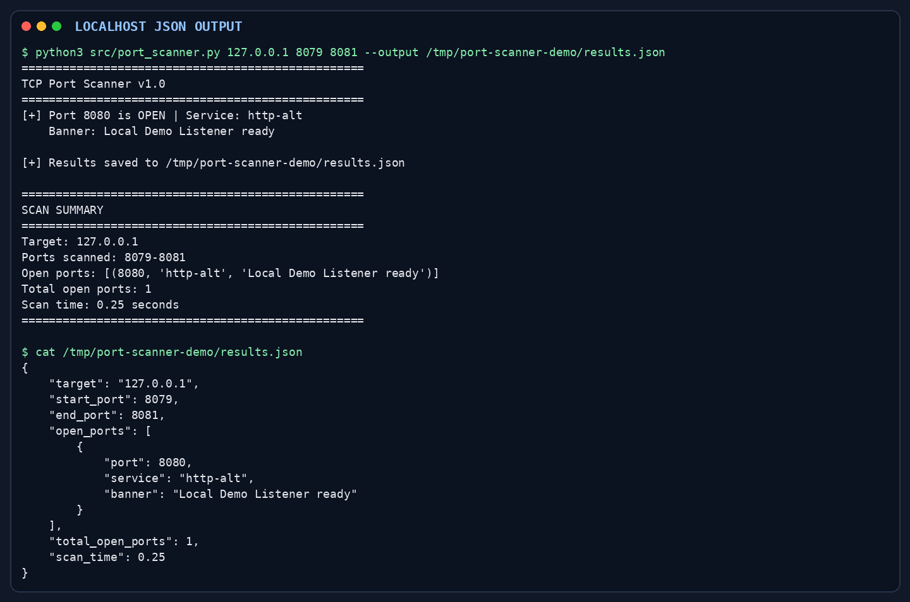

# Python Port Scanner

A command-line TCP port scanner written in Python. Give it an IPv4 address and a port range; it checks the ports concurrently, reports open ports and their locally mapped TCP service names, and makes a best-effort attempt to read a service banner. Results can also be saved as JSON.

This project is a learning tool for understanding basic TCP connection-based port scanning and defensive network reconnaissance.

## Features

- Scans a user-specified inclusive range of TCP ports over IPv4.
- Uses a `ThreadPoolExecutor` with a fixed maximum of 50 worker threads.
- Validates the IPv4 target and port range before scanning.
- Checks ports with TCP `connect_ex` calls and reports successful connections as open.
- Looks up a conventional service name for each open TCP port using Python's local service database; reports `unknown` when no mapping is found.
- Attempts to read up to 1024 bytes of banner data from each open port, with a 2-second banner-read timeout.
- Prints open-port details and a scan summary, including elapsed time.
- Optionally writes structured results to a JSON file.
- Uses only Python standard-library modules; there are no third-party dependencies.

## Architecture / Workflow

```text
IPv4 target and inclusive port range
                 ↓
        Validate target and ports
                 ↓
   Submit one TCP check per port
       (up to 50 worker threads)
                 ↓
  Report successful TCP connections
                 ↓
 Local service-name lookup + banner attempt
                 ↓
       Terminal summary and optional JSON
```

The scanner uses TCP connect scanning. It does not perform a SYN scan or UDP scan. For each port, a failed or timed-out connection is omitted from the open-port results; the scanner does not distinguish closed ports from filtered or otherwise unreachable ports.

## Technology Stack

- Python 3
- `socket` for IPv4 TCP connections, timeouts, and service-name lookup
- `concurrent.futures.ThreadPoolExecutor` for concurrent port checks
- `argparse` for command-line parsing
- `json` for optional result files
- `time` for elapsed-time reporting

All imports come from Python's standard library. `requirements.txt` is currently empty, so there are no packages to install with pip.

## Project Structure

```text
Python-Port-Scanner/
├── src/
│   ├── port_scanner.py     Scanner implementation and CLI
│   └── scan_results.json   Saved JSON scan output
├── scan_results.json       Saved JSON scan output
├── requirements.txt        Empty; no external dependencies
├── LICENSE                 Empty; no license terms are provided
└── README.md
```

## Installation

Install Python 3, then clone the repository:

```bash
git clone https://github.com/Kkeshav356/Python-Port-Scanner.git
cd Python-Port-Scanner
```

No additional package installation is required. Run the scanner from the repository root with `python3` (or `python` where that invokes Python 3).

## Usage

The CLI takes a target IPv4 address, a starting port, and an ending port. Port bounds are inclusive and must be between 1 and 65535.

Scan ports 1 through 1024:

```bash
python3 src/port_scanner.py 192.0.2.10 1 1024
```

Scan a narrower range and save the report as JSON:

```bash
python3 src/port_scanner.py 192.0.2.10 20 100 --output results.json
```

`--output PATH` is the only optional CLI argument. The worker limit and socket timeouts are fixed in the implementation; there are no CLI options for changing them. Invalid target addresses and port ranges are reported as errors and terminate the scan.

## Demo

The screenshots below show real CLI runs against a temporary TCP listener bound only to `127.0.0.1`. The listener provided a simple demo banner; it was used to verify open-port reporting, the local service-name lookup, banner reading, range scanning, and JSON output.

### CLI Help



### Basic Local Scan



### Port Range and Banner Detection



### JSON Output



## Output

The terminal output lists each detected open port with its service-name lookup, and prints a banner when the banner read returns non-empty data. The final summary includes the target, requested range, open ports, count, and elapsed scan time.

When `--output` is supplied, the JSON file contains `target`, `start_port`, `end_port`, `open_ports`, `total_open_ports`, and `scan_time`. Each `open_ports` item contains `port`, `service`, and `banner`. The saved output is a report of that particular run; results depend on the target's current network state and reachability.

## Security and Responsible Use

Only scan systems and networks that you own or have explicit authorization to test. Port scanning can trigger monitoring alerts and may be restricted by organizational policy or law.

## Limitations

- TCP connect scanning only; UDP and raw-packet SYN scanning are not implemented.
- The scanner treats unsuccessful connections as non-open and does not identify whether a port is closed, filtered, or unreachable.
- Service names come from the local operating system's TCP service database. They are conventional port mappings, not verified service fingerprints.
- Banner grabbing is a best-effort read of up to 1024 bytes immediately after connecting. Services that wait for a client request, close early, or use protocols requiring negotiation may return no useful banner.
- Each connection attempt has a 1-second timeout and each banner attempt has a 2-second timeout. Scanning broad or filtered ranges can take time; concurrency is fixed at 50 threads and cannot be configured from the CLI.
- The implementation is IPv4-only and does not include rate limiting, retries, or a detailed record of failed-port states.
- There are currently no automated tests in the repository.

## Future Improvements

Possible follow-up work includes automated tests, configurable concurrency and timeouts, rate limiting, clearer reporting of filtered/unreachable ports, improved protocol-aware service identification, optional UDP scanning, and richer output formats. These are not current features.

## Testing

No automated tests are currently present in the repository, so there is no test command to run.

## License

The repository contains an empty `LICENSE` file, so it does not currently specify license terms. Add an appropriate license before redistributing the project under a license.
